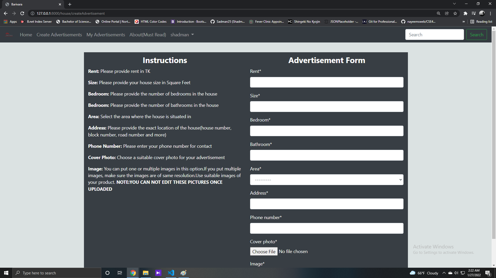

# BariVara-A-House-Rental-Site
This is a website where a user can look for a house on rent in their desired location. User can also post if they want to advertise about a house they want to give on rent.

So this is our landing page where it will ask the user to login.

If the user has no account then they can click "Register Here" which will redirect them to register page. In this page, user need to put necessary information to create an account for the website.

After logging in, the user will see the homepage(below).From the navbar, a user can go to various pages such as create advertisement, my advertisement and so on. Clicking on "Viuw Details page will lead them to dynamic advertisements page where they can see more details about a particular advertisement

After clicking "View Details" of any particular advertisement, it will lead to this page where more information of the particular advertisement is stored and rendered. The pages are dynamic which means, each advertisement will have seperate pages containing their details. The user who created the advertisement can be the only one who can edit and delete the advertisement. Any other users can view this page and comment if they want to from the comment box in the picture.

A user can also see the comments of other users on the same page below along with when they have commented. Each comments have its own reply section.

After clicking "Create Advertisements" from the navbar, it will lead the user to a page where a user has to put necessary information for posting and advertisement along with cover photo and images. Instructions for creating an advertisement is also beside to help user.

After clicking "My Advertisement" from the navbar, a user can only view the advertisements he/she has poster so far. View details will lead them to the details page containing advertisment details.

Clicking the user's name on the navbar will create a dropdown menu which will lead user to his/her profile page or logout from the system.

After clicking "My Profile" from the dropdown menu, it will lead the user to a page, where he/she can view their current given information as well as edit their information if necessary.

# Some Drawbacks
I have failed to create a feature where user can edit the additional images they have uploaded for the advertisement. There is a little bit of frontend problem in the "My Advertisements" page
